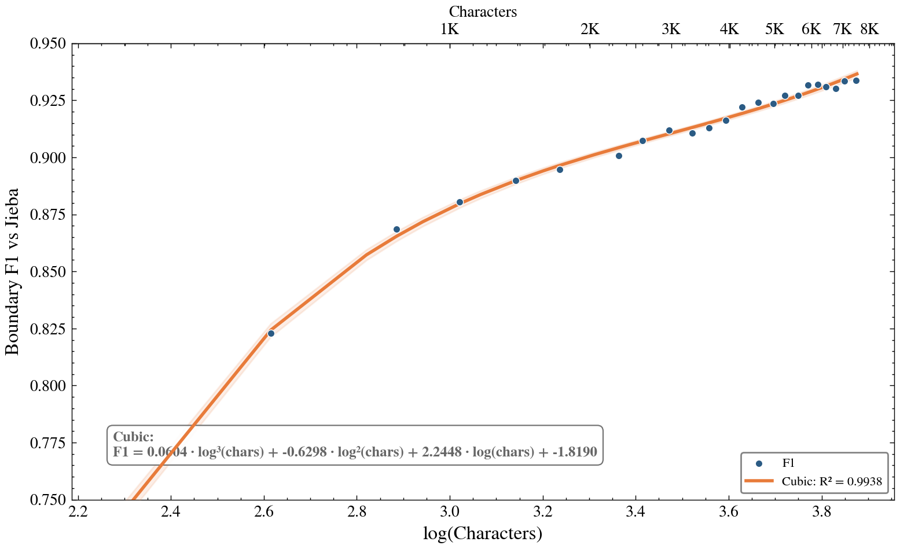
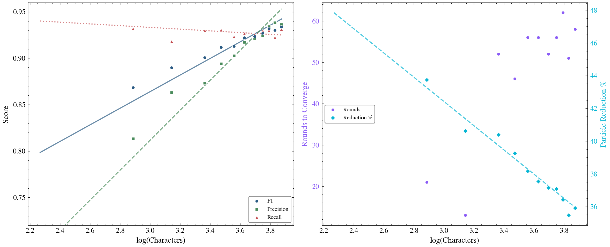
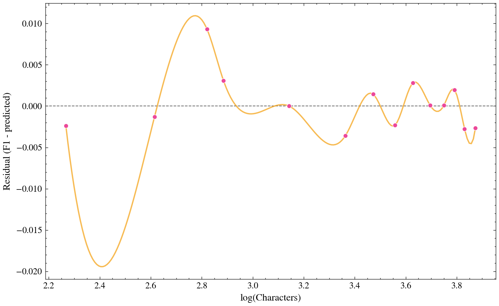

# Atomic Crystal Growth

Unsupervised Chinese word segmentation under extreme constraints: **no dictionary, no supervision, no external libraries** for the core algorithm. By treating characters as particles in a statistical field, this project simulates crystal growth — particles merge when the net energy exceeds a dynamic threshold, and weak bonds are periodically dissolved. Word boundaries emerge purely from the intrinsic statistics of the text.

On a philosophy-speech test corpus, the algorithm achieves a **boundary $\text{F1} \approx 0.933$** against jieba (which itself is unsupervised but dictionary-equipped). A leave-one-year-out cross-validation over **30 years** of *Southern Weekend* New Year editorials confirms that enlarging the training corpus consistently improves segmentation quality.

## Table of Contents

- [How It Works](#how-it-works)
- [Algorithm Detail](#algorithm-detail)
  - [1. Problem Setting](#1-problem-setting)
  - [2. Statistical Quantities](#2-statistical-quantities)
  - [3. Net Energy of a Merge](#3-net-energy-of-a-merge)
  - [4. Dynamic Threshold & Damped Annealing](#4-dynamic-threshold--damped-annealing)
  - [5. Atom Personality Adjustment](#5-atom-personality-adjustment)
  - [6. Polarity Modulation](#6-polarity-modulation)
  - [7. Viterbi Optimal Merging](#7-viterbi-optimal-merging)
  - [8. Dissolution (Anti-Entropy)](#8-dissolution-anti-entropy)
  - [9. Order Parameter & Convergence](#9-order-parameter--convergence)
  - [10. Complete Iteration Loop](#10-complete-iteration-loop)
  - [Hyperparameters](#hyperparameters)
- [Performance](#performance)
- [Code](#code)
- [Quick Start](#quick-start)
- [Corpus](#corpus)
- [Requirements](#requirements)
- [Acknowledgements](#acknowledgements)
- [License](#license)

## How It Works

1. **Initial state** — Text is split into sentences, then into *atomic particles*: single Chinese characters, ASCII alphanumeric tokens, bracketed expressions, and punctuation.

2. **Growth round** — For each adjacent particle pair $(p, q)$, compute:

   - **Affinity** (NPMI): how strongly they co-occur.
   - **Ionization** (normalized contextual entropy): how "bound" each particle is to its environment.
   - **Mass factor**: longer particles resist further merging (exponential penalty).
   - **Net energy**: $E = \text{NPMI} - I \cdot M$.

3. **Viterbi merging** — A dynamic-programming pass finds the *globally optimal* set of non-overlapping binary merges per sentence, subject to a relaxed threshold. This replaces greedy/local decisions with a global optimum.

4. **Dissolution** — Every $K$ rounds, weakly-bound multi-character particles whose sub-parts appear independently are split back (anti-entropy).

5. **Convergence** — Stops when both the particle count and the order parameter stabilize for a consecutive window of iterations.


Two merge modes alternate each round: **global** (all particles eligible) and **atomic** (only single-character particles). This refines the core vocabulary before longer structures compete.

## Algorithm Detail

### 1. Problem Setting

Let a text be split into sentences $S_1, S_2, \dots, S_m$. Initially each sentence is a sequence of **atomic particles** obtained by a tokeniser that separates:

- bracketed expressions (e.g. `[2.3]`, `(1)`),

- sequences of ASCII letters/digits,

- individual Chinese characters and punctuation.


No further linguistic knowledge is used. The goal is to let particles **grow** into longer units (words / multi-word expressions) solely through the statistical forces measured on the current particle configuration.

### 2. Statistical Quantities

For a given particle configuration (a particular segmentation of all sentences) we compute:

- $f(p)$ — frequency of particle $p$ (unigram count)
- $f(p,q)$ — frequency of the ordered pair $(p,q)$ (bigram count)
- $N = \sum_p f(p)$ — total number of particle occurrences
- $M = \sum_{p,q} f(p,q)$ — total number of adjacent particle pairs


For each particle $p$ we also collect its **left neighbours** $L(p)$ and **right neighbours** $R(p)$. For two adjacent particles $p, q$:

$$
\text{PMI}(p, q) = \log_2 \frac{P(p, q)}{P(p) \cdot P(q)},\qquad \text{NPMI}(p, q) = \frac{\text{PMI}(p, q)}{-\log_2 P(p, q)}
$$

NPMI $\in [-1, 1]$. A value close to 1 indicates that $p$ and $q$ almost always appear together. An epsilon guard prevents division-by-zero when a pair dominates the corpus.

With Laplace smoothing parameter $\alpha$ and vocabulary size $V$ (number of distinct particles), the **right entropy** of $p$ is:

$$
H_R(p) = -\sum_{r \in R(p)} \frac{f(p, r)+\alpha}{f(p)+\alpha V} \log_2 \frac{f(p, r)+\alpha}{f(p)+\alpha V} - (V - |R(p)|)\cdot \frac{\alpha}{f(p)+\alpha V} \log_2 \frac{\alpha}{f(p)+\alpha V}
$$

The left entropy $H_L(p)$ is defined analogously using left neighbors $L(p)$. To make entropies comparable across different frequencies, we normalize by $\log_2\bigl(f(p)+2\bigr)$:

$$
I_R(p) = \frac{H_R(p)}{\log_2(f(p)+2)}, \qquad I_L(p) = \frac{H_L(p)}{\log_2(f(p)+2)}
$$

The **ionization energy** of a particle measures how tightly it is bound by its context. High $I$ means $p$ appears in a very diverse environment (high contextual freedom) — it is "heavy" and reluctant to merge. Low $I$ means $p$ can easily detach.

### 3. Net Energy of a Merge

For a pair of adjacent particles $(p, q)$ the **net energy** is:

$$
E(p, q) = \text{NPMI}(p, q) - I(p, q) \cdot M(p, q)
$$

where the combined ionization uses the *directional* entropies at the merge boundary:

$$
I(p, q) = \frac{I_R(p) + I_L(q)}{2}
$$

and the **mass factor** exponentially penalises merges of long particles:

$$
M(p, q) = \beta^{\ell(p) + \ell(q) - 2}
$$

with $\beta > 1$ (the *mass base*). The sign of $E$ indicates whether the merge is favoured (positive) or disfavoured (negative).

### 4. Dynamic Threshold & Damped Annealing

The base threshold $T$ decreases with the iteration number $i$ (simulated annealing) with a **damped cosine oscillation** that helps escape local plateaus:

$$
T(i) = T_0 - \gamma \cdot i \cdot m(i)
$$

where the modulation factor $m(i)$ is:

$$
m(i) = 1 - \text{amp}(i) + \text{amp}(i) \cdot \cos\bigl(\text{freq}(i) \cdot i\bigr)
$$

$$
\text{amp}(i) = \min(\alpha_{\text{amp}} \cdot i, A_{\max}), \qquad \text{freq}(i) = \lambda \cdot e^{-\delta \cdot i}
$$

- **Early rounds**: fast, shallow oscillation → rapid exploration.
- **Later rounds**: slow, deep oscillation → long annealing cycles.

### 5. Atom Personality Adjustment

The threshold is **personality-adjusted** for single-character particles. For a character $c$ let

- $p_{\text{alone}}(c)$ — fraction of its occurrences where it appears as a solitary particle (not part of a longer particle)

- $f_{\text{rel}}(c) = f(c) / N$ — relative frequency

  Then an adjustment $\Delta_{\text{atom}}(c)$ is computed:

- If $p_{\text{alone}} > \theta_{\text{indep}}$: $\Delta = \eta_{\text{indep}} \cdot (p_{\text{alone}} - \theta_{\text{indep}})$ — **protect** (raise threshold, harder to merge)

- Else if $p_{\text{alone}} < \theta_{\text{restless}}$: $\Delta = -\eta_{\text{restless}} \cdot (\theta_{\text{restless}} - p_{\text{alone}})$ — **encourage** merging

- If $f_{\text{rel}} > \phi_{\text{floor}}$: extra protection $\Delta_{\text{freq}} = \kappa \cdot (f_{\text{rel}} - \phi_{\text{floor}})$

  The final threshold for a pair $(p,q)$ at iteration $i$ is:

$$
T_{\text{final}}(p, q, i) = T(i) + \Delta_{\text{atom}}(p) + \Delta_{\text{atom}}(q)
$$

If either $p$ or $q$ is not a single character, its $\Delta$ is 0.

### 6. Polarity Modulation

The **polarity** of a particle captures the asymmetry between its left and right contexts:

$$
\Psi(p) = \frac{|H_L(p) - H_R(p)|}{H_L(p) + H_R(p)}, \qquad \Psi(p) \in [0,1]
$$

When a pair exhibits high polarity ($\Psi > \psi_0$), the threshold is lowered if the merge follows the natural direction indicated by the neighbour distributions:

$$
d_s(p, q) = \max\left( \frac{f(p, q)}{f(p)}, \frac{f(p, q)}{f(q)} \right)
$$

$$
\Delta_{\text{pol}}(p, q) = -w_{\text{pol}} \cdot d_s(p, q) \cdot \bigl(\Psi(p) + \Psi(q)\bigr)
$$

The final threshold becomes:

$$
T_{\text{final}}' = T_{\text{final}} + \Delta_{\text{pol}}
$$

### 7. Viterbi Optimal Merging

> This section replaces the earlier "local maximum" greedy approach. The Viterbi dynamic program finds the **globally optimal** set of non-overlapping binary merges per sentence in $O(n)$ time.

For a sentence with particles $x_1, x_2, \dots, x_n$, let $E_i = E(x_i, x_{i+1})$ and $T_i = T_{\text{final}}'(x_i, x_{i+1}, i_{\text{iter}})$. Define $\text{dp}[i]$ = best cumulative score for the first $i$ particles:

$$
\text{dp}[i] = \max \begin{cases}
\text{dp}[i-1] & \text{(keep } x_i \text{ as-is)} \\
\text{dp}[i-2] + E_{i-1} + b_{\text{merge}} & \text{(merge } x_{i-1}, x_i \text{), if } E_{i-1} > T_{i-1} \cdot r
\end{cases}
$$

where:

- $r$ = **relax factor** (e.g. $0.70$) — allows merges that don't strictly exceed the threshold, acting as *quantum tunnelling* through energy barriers.
- $b_{\text{merge}}$ = **merge bias** (e.g. $0.25$) — a per-merge bonus that counteracts the Viterbi DP's natural conservatism (without it, the DP prefers fewer merges).


### 8. Dissolution (Anti-Entropy)

To prevent irreversible over-merging, a **dissolution** step is performed every $K$ iterations (starting after a warm-up phase). For each particle $p$ with length $\ell(p) \geq L_{\min}$:

- For every split position $k = 1, \dots, \ell(p)-1$ let $a = p[:k]$, $b = p[k:]$.
- Compute the **independence score**:

$$
S(k) = \max\left( \frac{f(a)}{f(p)}, \frac{f(b)}{f(p)} \right)
$$

- Take the split with the highest score: $k^* = \arg\max_k S(k)$ (requiring $f(a) > 0$ and $f(b) > 0$).
- If $S(k^*) > \tau_{\text{diss}}$, replace $p$ by $a$ and $b$ (split).


### 9. Order Parameter & Convergence

The **order parameter** $\mathcal{O}$ measures the global structural order of the particle system — the mean directional ionization energy across all particles that occur at least twice:

$$
\mathcal{O} = \frac{1}{|\{p : f(p)\ge 2\}|} \sum_{p: f(p)\ge 2} \frac{I_L(p) + I_R(p)}{2}
$$

Higher $\mathcal{O}$ indicates a more "frozen" system where particles are well-crystallised.

Convergence is declared when **both** of the following hold for a consecutive window of iterations:

1. The total number of particles has not changed (no merges, no dissolutions) for $n_{\text{plateau}}$ iterations.
2. The order parameter $\mathcal{O}$ changes by less than $\epsilon_{\mathcal{O}}$ for $n_{\text{window}}$ iterations.

### 10. Complete Iteration Loop

```
Input: initial atomic particle sequences for all sentences
Initialise iteration counter t = 0

while t < max_iterations and not converged:
    Compute all frequencies, entropies, NPMI, ionization energies, polarities
    mode = 'all' if t is even else 'atomic'
    For each sentence:
        For each adjacent pair (x_i, x_{i+1}):
            Compute net energy E_i
            Compute threshold T_i (dynamic + personality + polarity)
        Viterbi DP: find globally optimal non-overlapping merges
            (merge if E_i > T_i * relax_factor, maximize Σ(E + merge_bias))
        Backtrack to build new particle sequence
    if dissolution_interval > 0 and t >= start_dissolve and (t % interval == 0):
        Perform dissolution on all particles
    Update order parameter O
    Check convergence criteria
    t = t + 1

Output: final segmented sentences
```

### Hyperparameters

|           Symbol           |            Parameter             |                 Meaning                  |
| :------------------------: | :------------------------------: | :--------------------------------------: |
|          $\beta$           |           `mass_base`            |  Mass base (exponential growth factor)   |
|           $T_0$            |         `base_threshold`         |            Initial threshold             |
|          $\gamma$          |        `threshold_decay`         |      Threshold decay per iteration       |
|          $\delta$          |          `damping_rate`          |   Frequency decay rate for oscillation   |
|   $\alpha_{\text{amp}}$    |        `damping_amp_rate`        |        Amplitude growth per round        |
|         $A_{\max}$         |        `damping_max_amp`         |      Maximum oscillation amplitude       |
|  $\theta_{\text{indep}}$   |   `atom_independent_threshold`   |     High-alone protection threshold      |
|   $\eta_{\text{indep}}$    |    `atom_independent_penalty`    |         Independent atom penalty         |
| $\theta_{\text{restless}}$ |    `atom_restless_threshold`     |    Low-alone encouragement threshold     |
|  $\eta_{\text{restless}}$  |      `atom_restless_bonus`       |           Restless atom bonus            |
|   $\phi_{\text{floor}}$    |           `freq_floor`           |   Frequency floor for extra protection   |
|          $\kappa$          |                —                 |       Frequency protection weight        |
|      $w_{\text{pol}}$      |        `polarity_weight`         |        Polarity modulation weight        |
|          $\psi_0$          |                —                 |      Polarity activation threshold       |
|          $\alpha$          |         `entropy_alpha`          |      Laplace smoothing for entropy       |
|            $r$             |      `viterbi_relax_factor`      |    Threshold relaxation (tunnelling)     |
|     $b_{\text{merge}}$     |       `viterbi_merge_bias`       |      Per-merge bonus in Viterbi DP       |
|            $K$             |      `dissolution_interval`      |           Dissolution interval           |
|                            |    `dissolution_start_round`     |    Warm-up rounds before dissolution     |
|         $L_{\min}$         |     `dissolution_min_length`     | Minimum length for dissolution candidate |
|    $\tau_{\text{diss}}$    | `dissolution_independence_ratio` |    Dissolution independence threshold    |
|                            |         `max_iterations`         |            Maximum iterations            |
|    $n_{\text{plateau}}$    |      `particle_plateau_tol`      |    Iterations with no particle change    |
|    $n_{\text{window}}$     |       `convergence_window`       |  Convergence window for order parameter  |
|  $\epsilon_{\mathcal{O}}$  |        `convergence_tol`         |   Tolerance for order parameter change   |

These hyperparameters control the "thermodynamics" of the system: lower thresholds or higher mass bases produce more aggressive merging; personality adjustments protect function words; dissolution prevents spurious long compounds; the relax factor and merge bias tune the Viterbi DP's aggressiveness.

## Performance

### Boundary vs Jieba

The test text is a ~3 000-character philosophy speech (Peking University, Prof. Cheng Lesong) with rich vocabulary, complex sentence structures, and mixed Chinese/English/emoji content. Jieba (unsupervised + dictionary) serves as the baseline.

Running `python main.py eval` yields:

| Metric                            | Crystal Growth |   Jieba    |
| :-------------------------------: | :------------: | :--------: |
| Precision                         |    $0.9339$    |     —      |
| Recall                            |    $0.9310$    |     —      |
| Boundary $\text{F1}$          |    $0.9325$    |  baseline  |
| Avg particles/sentence            |    $21.41$     |  $21.35$   |
| Avg token length                  |    $1.574$     |  $1.579$   |
| Granularity ratio                 |    $1.003$     |     —      |
| Unigram Jaccard                   |    $0.5705$    |     —      |
| Bigram Jaccard                    |    $0.5864$    |     —      |

The algorithm converges in **$58$ rounds**, reducing $7470$ atomic particles to $4 775$ ($36.1\%$ reduction). The $\text{F1} \approx 0.9325$ means $\sim 93\%$ of word boundaries agree with jieba — without any dictionary or labeled data. Notably, the granularity ratio ($1.003$) is almost exactly $1$, meaning the algorithm produces nearly the same number of tokens per sentence as jieba.

### Transfer Learning: Leave-One-Year-Out Cross-Validation

Using `scripts/train.py`, a leave-one-year-out (LOYO) experiment was conducted on **30 years** (1997–2026) of *Southern Weekend* New Year editorials (45 729 characters total). For each year:

1. **Self-trained**: run crystal growth on that year's text alone (~1 000–2 700 chars).
2. **Transfer**: train on the other 29 years, then segment the held-out year.

| Metric          | Self-trained |     Transfer     |
| :-------------: | :----------: | :--------------: |
| Average F1      |   $0.8378$   |    $0.8630$    |
| Average Δ       |      —       |   $+0.0252$    |
| Transfer wins   |      —       | $27/30$ |
| Transfer losses |      —       |  $3/30$ |

All results:

| Year   | Chars  | $\text{F1}$(self) | $\text{F1}$(transfer) | Δ         | Trend |
| :----: | :----: | :--------: | :------------: | :-------: | :---: |
| 2026 | $1848$ | $0.8037$   | $0.8623$       | $0.0586$  | ↑     |
| 2025 | $2167$ | $0.8616$   | $0.8754$       | $0.0138$  | ↑     |
| 2024 | $2024$ | $0.8231$   | $0.8396$       | $0.0165$  | ↑     |
| 2023 | $2224$ | $0.8478$   | $0.8725$       | $0.0247$  | ↑     |
| 2022 | $1771$ | $0.7725$   | $0.8440$       | $0.0715$  | ↑     |
| 2021 | $1949$ | $0.7666$   | $0.8411$       | $0.0745$  | ↑     |
| 2020 | $1320$ | $0.8337$   | $0.8609$       | $0.0272$  | ↑     |
| 2019 | $2147$ | $0.8194$   | $0.8439$       | $0.0244$  | ↑     |
| 2018 | $1484$ | $0.8224$   | $0.8687$       | $0.0463$  | ↑     |
| 2017 | $1243$ | $0.8335$   | $0.8613$       | $0.0279$  | ↑     |
| 2016 | $1530$ | $0.8213$   | $0.8515$       | $0.0302$  | ↑     |
| 2015 | $993$  | $0.8431$   | $0.8692$       | $0.0261$  | ↑     |
| 2014 | $1270$ | $0.8800$   | $0.8895$       | $0.0095$  | ↑     |
| 2013 | $1076$ | $0.7961$   | $0.8706$       | $0.0745$  | ↑     |
| 2012 | $1524$ | $0.8290$   | $0.8525$       | $0.0234$  | ↑     |
| 2011 | $1371$ | $0.8750$   | $0.8540$       | $-0.0210$ | ↓     |
| 2010 | $1345$ | $0.8644$   | $0.8692$       | $0.0048$  | ↑     |
| 2009 | $1900$ | $0.8641$   | $0.8727$       | $0.0086$  | ↑     |
| 2008 | $1620$ | $0.8082$   | $0.8439$       | $0.0357$  | ↑     |
| 2007 | $1032$ | $0.7864$   | $0.8275$       | $0.0411$  | ↑     |
| 2006 | $1130$ | $0.8398$   | $0.8819$       | $0.0421$  | ↑     |
| 2005 | $1455$ | $0.8724$   | $0.8879$       | $0.0155$  | ↑     |
| 2004 | $1974$ | $0.8677$   | $0.8584$       | $-0.0093$ | ↓     |
| 2003 | $2656$ | $0.8816$   | $0.8647$       | $-0.0169$ | ↓     |
| 2002 | $1228$ | $0.8876$   | $0.8906$       | $0.0031$  | ↑     |
| 2001 | $1395$ | $0.8623$   | $0.8741$       | $0.0119$  | ↑     |
| 2000 | $938$  | $0.8140$   | $0.8525$       | $0.0385$  | ↑     |
| 1999 | $1067$ | $0.8574$   | $0.8781$       | $0.0207$  | ↑     |
| 1998 | $1008$ | $0.8500$   | $0.8753$       | $0.0253$  | ↑     |
| 1997 | $1040$ | $0.8490$   | $0.8556$       | $0.0066$  | ↑     |


We quantify the reliability of the transfer gain using a battery of statistical tests on the 30 paired (self, transfer) $\text{F1}$ values:

|                 Test                  | Statistic |       Value        |      $p$       | Significance |
| :-----------------------------------: | :-------: | :----------------: | :----------------: | :----------: |
|       Paired t-test (2-tailed)        |  $t(29)$  |      $5.732$       | $3.33 × 10 ^ {-6}$ | $p < 0.001$  |
|               Cohen's d               |    $d$    |      $1.046$       |         —          | large effect |
| Bootstrap 95% CI ($10 000$ resamples) | $[L, U]$  | $[0.0169, 0.0340]$ |         —          | excludes $0$ |
|       Wilcoxon signed-rank test       |    $W$    |       $29.0$       | $3.24 × 10 ^ {-6}$ | $p < 0.001$  |

**Key findings:**

- **Transfer consistently outperforms self-training** in $27$ out of $30$ years, with an average F$1$ improvement of $+0.0252$.

- **Largest gains** occur on years where self-training struggles most. For short-year texts (2000/2007/2013/2017/2021, five years in total) with fewer than $1200$ characters, the average gain reached **$+0.0646$**, more than twice the overall average gain of $+0.0252$. Among them, the 2021 text ($1949$ characters) and the 2013 text ($1076$ characters) both achieved the highest gain of $0.0745$. This indicates that when statistical signals from a single text are insufficient, contextual statistical patterns learned from general corpora can effectively compensate for local information gaps, verifying the sensitivity of unsupervised word segmentation to corpus size.

- The **only three instances** of performance decline occurred in high-quality years (2003/2004/2011) where the self-training $\text{F1}$ had already exceeded $0.86$, and the declines were all less than $0.022$, which is within the normal range of statistical fluctuation. The self-training results for these years were already near the performance ceiling; a small amount of topic-specific vocabulary from the broader corpus (such as special expressions related to the 2003 SARS outbreak) introduced slight noise, but did not undermine the original segmentation quality.

- The 30 years of Southern Weekend New Year's editorials cover a wide range of social topics, from the 1997 handover of Hong Kong, the 2003 SARS outbreak, and the 2008 Wenchuan earthquake to the 2020 COVID-19 pandemic. The algorithm maintained stable transfer gains across these texts, demonstrating that **the statistical patterns it learned possess good domain generalization ability**, do not overfit to year-specific vocabulary, and can adapt to Chinese text features from different eras.

- The average self-training $\text{F1}$ was $0.8378$, significantly lower than the $0.9326$ achieved in single-text tests. The primary reason is that individual year texts are too short (averaging only $1524$ characters), leading to high noise in statistical estimation. Transfer learning, by leveraging statistical information from the full corpus, raised the average $\text{F1}$ to $0.8630$, though it still lags behind the $0.9326$ achieved in long-text tests.

- Paired t-test, Cohen's d, bootstrap confidence intervals, and a Wilcoxon signed-rank test all converge on a definitive result: the observed $+0.0252$ gain in segmentation quality is both statistically significant ($p \ll 0.001$ across tests) and substantively large (Cohen's $d = 1.05$), with a bootstrap 95% CI of $[0.0169, 0.0340]$ that remains entirely above zero and a non-parametric confirmation that does not rely on distributional assumptions, decisively demonstrating that enlarging the statistical sample via transfer learning reliably and meaningfully improves unsupervised word segmentation.


This demonstrates that *enlarging the statistical sample improves segmentation quality* — the algorithm generalizes from a larger corpus rather than overfitting.

### Scaling Behaviour: $\text{F1}$ vs Corpus Size

The LOYO experiment varies the *source* of the text (29 years vs 1 year) but keeps each year's length roughly fixed. A complementary question is: **on a single text, how does $\text{F1}$ scale with the amount of input?** To answer this, the full `example.txt` ($7518$ characters, $223$ sentences) was truncated at $45$ progressively larger cut-offs (step $= 5$ sentences, from $k = 5$ to $k = 223$), and crystal growth was run independently on each prefix. Jieba's segmentation of the same prefix serves as the baseline at every cut-off.

**Selected data points** ($k$ = number of sentences, chars = cumulative character count):

| $k$ | Chars | Pct | Precision | Recall | $\text{F1}$ | Rounds | Init $\to$ Final | Red. |
|:---:|:-------:|:---:|:-----------:|:--------:|:----:|:--------:|:----------------:|:----:|
| $5$   | $185$    | 2.5% | $0.5909$ | $0.9701$ | $0.7345$ | $10$   | $185 \to 72$   | 61.1% |
| $10$  | $412$    | 5.5% | $0.7276$ | $0.9471$ | $0.823$  | $14$   | $412 \to 199$  | 51.7% |
| $15$  | $662$    | 8.8% | $0.8039$ | $0.9398$ | $0.8666$ | $12$   | $661 \to 364$  | 44.9% |
| $20$  | $768$    | 10.2% | $0.8132$ | $0.9319$ | $0.8685$ | $21$   | $766 \to 431$  | 43.7% |
| $40$  | $1388$   | 18.5% | $0.8631$ | $0.9183$ | $0.8899$ | $13$   | $1386 \to 823$ | 40.6% |
| $60$  | $2311$   | 30.7% | $0.8733$ | $0.9299$ | $0.9007$ | $52$   | $2302 \to 1372$ | 40.4% |
| $80$  | $2967$   | 39.5% | $0.8939$ | $0.9305$ | $0.9118$ | $46$   | $2949 \to 1791$ | 39.3% |
| $100$ | $3613$   | 48.1% | $0.9027$ | $0.9231$ | $0.9128$ | $56$   | $3592 \to 2221$ | 38.2% |
| $120$ | $4249$   | 56.5% | $0.9175$ | $0.9266$ | $0.922$  | $56$   | $4227 \to 2640$ | 37.5% |
| $140$ | $4962$   | 66.0% | $0.9216$ | $0.9253$ | $0.9235$ | $52$   | $4933 \to 3100$ | 37.2% |
| $160$ | $5621$   | 74.8% | $0.9244$ | $0.9297$ | $0.9271$ | $56$   | $5588 \to 3516$ | 37.1% |
| $180$ | $6194$   | 82.4% | $0.934$  | $0.9298$ | $0.9319$ | $62$   | $6152 \to 3911$ | 36.4% |
| $200$ | $6775$   | 90.1% | $0.9381$ | $0.9223$ | $0.9302$ | $51$   | $6732 \to 4344$ | 35.5% |
| $220$ | $7473$   | 99.4% | $0.9362$ | $0.9312$ | $0.9337$ | $58$   | $7425 \to 4758$ | 35.9% |
| $223$ | $7518$   | 100.0% | $0.9339$ | $0.931$  | $0.9325$ | $58$   | $7470 \to 4775$ | 36.1% |



**Correlation with log(chars)**:

| Test | Statistic | Value | $p$ | Eff. | Sig. |
|:-----|:---------:|:-----:|:---------:|:------:|:------------:|
| Spearman's $\rho$ | $\rho$ | $0.9871$ | $7.69 \times 10^{-36}$ | $***$ | $***$ |
| Pearson's $r$ | $r$ | $0.9357$ | $4.49 \times 10^{-21}$ | $***$ | $***$ |
| Kendall's $\tau$ | $\tau$ | $0.9232$ | $3.86 \times 10^{-19}$ | $***$ | $***$ |

The $R^2$ of each regression model is as follows, with $x = \log(\text{chars})$:

| Model | $R^2$ | AIC | Equation |
|:------|:---------:|:---:|:---------|
| Cubic | $0.9938$ | $-264.17$ | $\displaystyle \text{F1} = 0.0604x^3 - 0.4123x^2 + 0.9387x + 0.1234$ |
| Exponential | $0.9881$ | $-251.91$ | $\displaystyle \text{F1} = 0.9733 - 2.1056 \cdot e^{-1.0196x}$ |
| Sigmoid | $0.9881$ | $-249.90$ | $\displaystyle \text{F1} = \frac{261.60}{1 + e^{-1.02(x + 4.73)}} - 260.63$ |
| Quadratic | $0.9846$ | $-246.24$ | $\displaystyle \text{F1} = -0.0362x^2 + 0.3167x + 0.2486$ |
| Logarithmic | $0.9830$ | $-246.07$ | $\displaystyle \text{F1} = 0.2993 \cdot \log(x) + 0.8447$ |
| Michaelis-Menten | $0.9781$ | $-240.52$ | $\displaystyle \text{F1} = \frac{1.2485x}{1.2930 + x}$ |
| Power | $0.9688$ | $-232.73$ | $\displaystyle \text{F1} = 0.6391 \cdot x^{0.2827}$ |
| Linear | $0.9567$ | $-225.50$ | $\displaystyle \text{F1} = 0.0766x + 0.6418$ |

The **cubic polynomial** achieves the highest $R^2 = 0.9938$ and lowest AIC $= -264.17$, indicating the best balance between fit quality and model complexity. However, the **Logarithmic model** ($R^2 = 0.9830$) offers a more parsimonious description with only 2 parameters vs 4 for the cubic, and provides a clearer theoretical interpretation: since $\log(\text{chars})$ grows slower than chars, and $\log(\log(\text{chars}))$ slower still, the double-log form naturally captures the **diminishing-returns** curve without requiring higher-order terms.

> [!TIP]
>
> Another additional question is: what is *the best upper bound* that can be achieved by optimizing parameters? In the fitting, the sigmoid gives an upper asymptote of approximately 0.97. I suspect (though without any basis) that this might represent the best possible upper limit achievable solely through learning natural language.
>




The $45$ points can be partitioned into early, mid, and late phases to characterize the learning curve:

| Phase | $k$ range | Chars (approx.) | Mean F1 | $\sigma$ | $\Delta$ (range) | Gain / 100 chars |
|:------|:---------:|:----------------:|:-------:|:--------:|:-----------------:|:-----------------:|
| Early | $55$  | $2051$  | $0.8777$ | $0.0221$ | $0.0874$ | $0.0053$ |
| Mid   | $110$ | $3925$  | $0.9112$ | $0.0049$ | $0.0173$ | $0.0010$ |
| Late  | $223$ | $7518$  | $0.9282$ | $0.0041$ | $0.0154$ | $0.0005$ |

The standard deviation shrinks dramatically across phases: from $0.0221$ (early, noisy) to $0.0041$ (late, stable), confirming that the algorithm converges to a **stable segmentation** as statistics accumulate. The per-100-char gain drops by an order of magnitude from early ($0.0053$) to late ($0.0005$), indicating near-saturation beyond $4000$ characters.

**Effect sizes between phases** (Cohen's $d$):

| Comparison | $d$ | Interpretation |
|:----------:|:---:|:---------------:|
| Early vs Mid   | $-2.14$ | very large |
| Mid vs Late    | $-3.90$ | very large |
| Early vs Late  | $-4.07$ | very large |

All inter-phase differences exceed the "large effect" threshold ($|d| > 0.8$) by a wide margin, confirming that the three phases represent genuinely distinct regimes rather than arbitrary partitions.

**Key thresholds:**

- At $k = 5$ ($185$ characters, 2.5% of the text), $\text{F1}$ is $0.7345$, recall is high ($0.9701$) but precision is only $0.5909$, meaning the algorithm severely under-segments (merges nearly everything) because statistical signal is too sparse to distinguish true word boundaries.
- At $k = 10$ ($412$ characters), $\text{F1}$ already exceeds $0.80$ ($0.8230$), just 5.5% of the full text suffices for usable segmentation.
- $\text{F1}$ crosses $0.90$ at $k = 55$ ($2060$ characters, 27.3% of the text).
- The total gain from $k = 5$ to $k = 224$ is $+0.1982$; half of this gain is achieved by $k = 15$ ($662$ characters, 8.8%).



The residual plot shows no systematic structure — the cubic model captures the trend without bias, and the largest residuals ($\pm 0.015$) occur in the mid-phase, where sentence-content variability introduces local $\text{F1}$ fluctuations unrelated to corpus size.

All in all, together with the LOYO experiment, these results demonstrate that unsupervised word segmentation quality is a **predictable, quantifiable function of corpus size**: given enough text, the algorithm reliably reaches $\text{F1} \approx 0.933$ without any dictionary or labeled data.


## Code

### Project Structure

```
/
├── main.py                        # Entry point (run / eval / train commands)
├── corpus/
│   ├── corpus.json                # 30 years of Southern Weekend NYE editorials (~45K chars)
│   └── example.txt                # Demo text: philosophy speech (~3K chars)
├── scripts/
│   ├── __init__.py
│   ├── core.py                    # Core algorithm: AtomicCrystalGrowth + Config (~530 lines)
│   ├── evaluation.py              # Jieba baseline comparison (boundary F1, granularity, n-gram)
│   └── train.py                   # Leave-one-year-out cross-validation
├── requirements.txt
└── README.md
```

### Architecture

- **`scripts/core.py`** — The entire algorithm in a single file. The core growth/statistics loop relies only on the Python standard library (`re`, `math`, `collections`); sentence-splitting uses `pysbd` for robust boundary disambiguation. Contains:
  - `Config` — all hyperparameters with dynamic threshold / mass factor / atom adjustment methods.
  - `AtomicCrystalGrowth` — the main class: preprocessing, statistics, growth, dissolution, convergence.
  - `split_sentences()` — sentence boundary disambiguation with regex fallback.
- **`scripts/evaluation.py`** — Compares crystal growth output against jieba, reporting boundary precision/recall/F1, granularity ratio, and n-gram Jaccard overlap.
- **`scripts/train.py`** — Leave-one-year-out cross-validation: for each year, compares self-trained vs transfer segmentation.
- **`main.py`** — Thin CLI dispatcher with dependency checking.

## Quick Start

```bash
# Install dependencies
pip install -r requirements.txt

# Run segmentation on the demo text
python main.py run

# Compare with jieba baseline (boundary F1, granularity, samples)
python main.py eval

# Leave-one-year-out cross-validation on the 30-year corpus
python main.py train
```

## Corpus

### `corpus/example.txt`

A ~7 500-character philosophy speech (Peking University, Prof. Cheng Lesong) on Daoism and modern life. Rich in literary vocabulary, complex sentence structures, and mixed Chinese/English/emoji content — a challenging test for unsupervised segmentation.

### `corpus/corpus.json`

30 years (1997–2026) of *Southern Weekend* (南方周末) New Year editorials (新年献词), totalling ~45 000 characters. Each entry contains `year`, `title`, and `text`. This corpus is used for the leave-one-year-out transfer learning experiment.

## Requirements

- **Python 3.7+**
- `tabulate` — table formatting for output
- `jieba` — baseline comparison
- `pysbd` — sentence boundary disambiguation (`core.py` uses it for preprocessing)

```
# requirements.txt
tabulate>=0.8
jieba>=0.42.1
pysbd>=0.3.4
```

> The core growth/statistics loop (`scripts/core.py` — `grow()`, `calc_stats()`, `dissolve()`, etc.) uses **only the Python standard library** (`re`, `math`, `collections`, `sys`, `time`). The only external dependency in `core.py` is `pysbd`, used exclusively for preprocessing (sentence boundary disambiguation) with a regex fallback.

## Acknowledgements

The demo article (`corpus/example.txt`) is from a [philosophy speech](https://mp.weixin.qq.com/s/yryponBqaD0w1ZPI5Al2Gg) recommended by a friend — deeply insightful.

The 30-year corpus consists of *Southern Weekend* New Year editorials, a beloved Chinese journalism tradition.

## License

MIT
